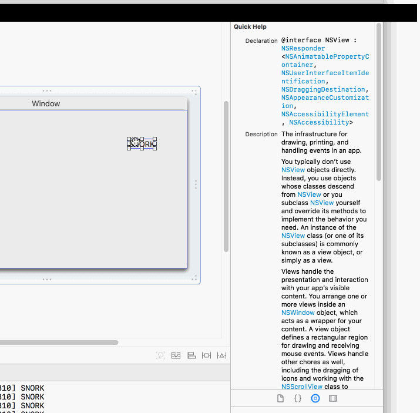

# CocoaScrollViews

For a project I'm needing to do some intense stuff with NSScrollViews and autolayout.
Rather than hack around the main codebase, here's a ~~playground~~ playpen to experiment
in.


### Xcode Annoyances

Been awhile since I made a new project. Figured I'd keep track of every bug and
annoyance.

* Committed files via command-line git.  Xcode kept showing "A" and "M", even after
  tweedling the different source code control paramters.  Needed to quit and restart.
* Adding a new Cocoa Subclass, Mac OS X template, and it defaults to "Subclass of UIView".
* First run has this wonderfully inviting output:

```
2018-05-25 21:43:15.043343-0400 CocoaScrollViews[13928:630085] [User
Defaults] Couldn't read values in CFPrefsPlistSource<0x6040000e1500>
(Domain: com.apple.PowerManagement, User: kCFPreferencesAnyUser,
ByHost: Yes, Container: (null), Contents Need Refresh: Yes): accessing
preferences outside an application's container requires
user-preference-read or file-read-data sandbox access, detaching from
cfprefsd
```

* Turned off app sandbox because I don't need it.
* Jump bar still flashes like a banshee. Luckily this is for an Objecive-C application,
  so I can edit in a editor that doesn't me want to quit Mac and iOS programming and
  go to the web.
* Clicking and dragging a label makes the help inspector blink.



* They somehow defeated the _extremely_ useful "command click to set a breakpoint if
  Xcode is in the background" :-(

* This is quite useful.  uuuh, thanks, I guess?

```
could not read data from
'/Users/markd/Library/Developer/Xcode/DerivedData/
CocoaScrollViews-bqomqjcnlyrjfygtzrjcqukqrvxg/Build/Intermediates.noindex/
CocoaScrollViews.build/Debug/CocoaScrollViews.build/
AutoExpandingTextFieldWindowController-PartialInfo.plist':
The file “AutoExpandingTextFieldWindowController-PartialInfo.plist”
couldn’t be opened because there is no such file.
```


